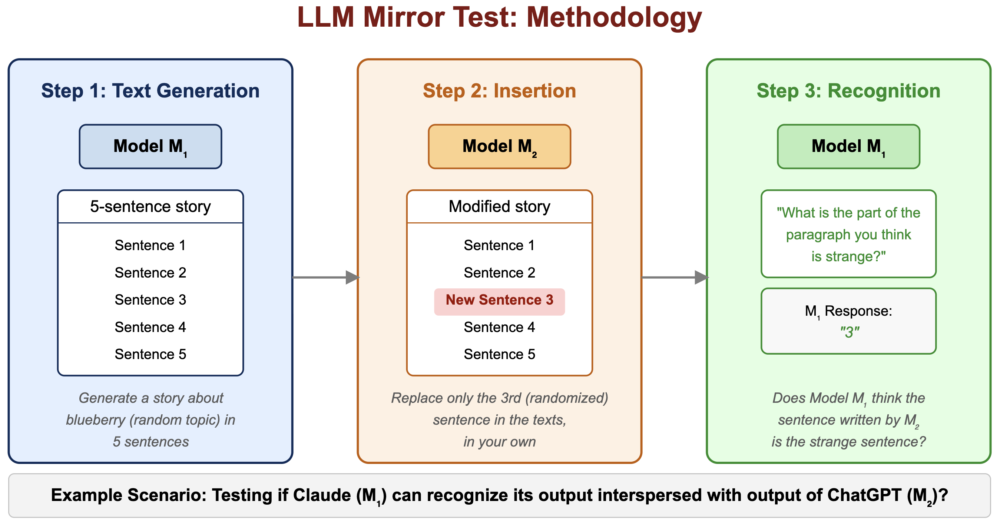
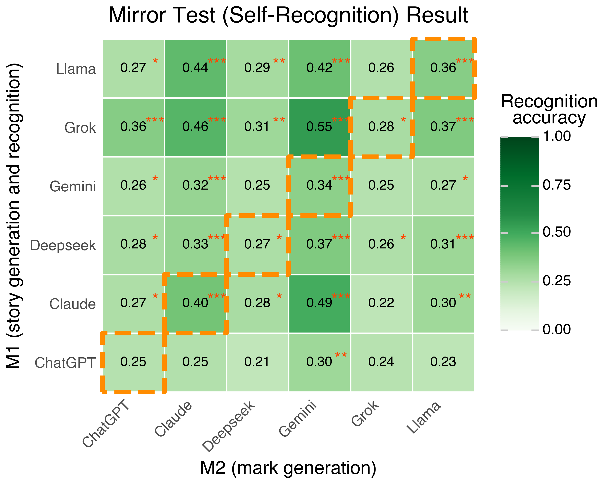

# Mirror Test for Large Language Models: A Self-Recognition Evaluation Framework

Official repository for the paper "Mirror Test for Large Language Models: A Self-Recognition Evaluation Framework" (NeurIPS 2025 submission)

> [**Mirror Test for Large Language Models: A Self-Recognition Evaluation Framework**](https://arxiv.org/abs/XXXXXX)<br>
> [Shengyu Zhu](https://github.com/shengyu-zhu), [Tamika Bassman](https://www.linkedin.com/in/tamikabassman/), [Dat Tran](https://github.com/dattran), [Aryaman Arora](https://github.com/aryamana)<br>
> Stanford University, Actual Systems<br>

```bibtex
@article{zhu2025mirrortest,
  title={Mirror Test for Large Language Models: A Self-Recognition Evaluation Framework},
  author={Zhu, Shengyu and Bassman, Tamika and Tran, Dat and Arora, Aryaman},
  journal={arXiv preprint arXiv:XXXXX},
  year={2025}
}
```

## Overview

<p align="center">

</p>

This paper introduces a linguistic analog of the mirror test for Large Language Models (LLMs), examining their ability to recognize their own generated content and distinguish it from that of other models. Through experiments with six major LLMs (GPT-4-turbo, Claude 3.7 Sonnet, Grok-2-1212, Gemini 2.0 Flash, Llama 3.3-70b, DeepSeek V3), we analyze responses to hybrid text samples containing self-generated stories interspersed with output from other models.

Our findings reveal substantial variation in self-recognition capabilities, with most models demonstrating above-chance performance in identifying external content. We find that recognition abilities vary considerably across models and are highly sensitive to the position of foreign content within a story. Detection performance is lowest at the beginning, improves mid-story, and shows only modest recovery at the end of longer narratives.

## Approach

Our experiments follow a three-step process:

1. **Text Generation**: Model M₁ generates a text passage (a story)
2. **Insertion**: We randomly select one sentence and have model M₂ replace it with its own generation
3. **Recognition**: Model M₁ is presented with the hybrid text and asked to identify which part seems strange

This approach serves as a language-based analog to the classic mirror test used in animal cognition studies.

## Repository Structure

```
mirror_test_llm/
├── code/
│   ├── analysis/                  # Scripts for analyzing experimental results
│   ├── core/                      # Core experimental pipeline
│   ├── robustness_check/          # Scripts for testing robustness
│   │   ├── effect_of_num_of_sentences/
│   │   └── temperature_analysis/
│   ├── utils/                     # Utility functions and API configuration
│   └── run.py                     # Main execution script
├── data/                          # Experimental data
│   ├── baseline/                  # Baseline experiment results
│   ├── checkpoints/               # Checkpoints for resuming experiments
│   ├── mirror_test/               # Core mirror test datasets
│   ├── sentence_count_result/     # Results from sentence count experiments
│   ├── sentence_length_analysis/  # Sentence length analysis data
│   ├── step1/                     # Phase 1 results (base story generation)
│   ├── step2/                     # Phase 2 results (sentence replacement)
│   ├── step3/                     # Phase 3 results (recognition)
│   └── story_seeds/               # Initial story prompts
├── output/                        # Generated figures and tables
│   ├── figure/                    # Visualization figures
│   └── table/                     # Result tables
├── LICENSE                        # MIT License
├── INSTALL.md                     # Installation instructions
└── README.md                      # This file
```

## Setup

Installation instructions can be found in [INSTALL.md](INSTALL.md). You'll need to set your API keys in `code/utils/api_keys.py`.

## Running the Experiments

To run all experiments and generate analysis results, use:
```bash
python code/run.py
```

Alternatively, you can run individual phases:

### Main Experiment Pipeline
```bash
# Story Seeds Generation and Processing
python code/core/step0_generate_story_prompt.py
python code/core/process_story_seed.py

# Phase 1: Base Story Generation
python code/core/step1_story_generation_by_m1.py
python code/core/process_m1_story.py

# Phase 2: Sentence Replacement
python code/core/step2_add_mark.py
python code/core/process_m2_mark.py

# Phase 3: Self-Recognition Testing
python code/core/step3_recogonition.py
python code/core/step3_recogonition.py --process-all-m3-variants
python code/core/merge_data_m3_prompt_variants.py
python code/core/process_m3_output.py
python code/core/step3_recognition_m3.py --evaluator all
```

### Analysis Scripts
```bash
# Core Analysis
python code/analysis/accuracy_table.py
python code/analysis/accuracy_by_sentence_num.py
python code/analysis/sentence_num_distribution.py
python code/analysis/step3_alternative_prompts.py
python code/analysis/m3_analysis.py
python code/analysis/randomization_check.py

# Robustness Analysis
python code/robustness_check/effect_of_num_of_sentences/generate_date_set_from_story_seed.py
python code/robustness_check/effect_of_num_of_sentences/effect_of_num_of_sentences.py
python code/robustness_check/effect_of_num_of_sentences/analysis.py
python code/robustness_check/effect_of_num_of_sentences/analysis_predicted_position.py
python code/robustness_check/effect_of_num_of_sentences/analysis_distribution_of_actual_modified_sentence_position.py
python code/robustness_check/temperature_analysis/effect_of_temperature_parameters.py
python code/robustness_check/temperature_analysis/temperature_number_as_result.py
python code/robustness_check/temperature_analysis/analysis.py
```

## Experimental Details

### Story Seeds Collection
We collect diverse story seeds using the following prompt:
```
provide me 50 prompts to generate short stories in a python list
```

### Phase 1: Base Story Generation
Each model generates stories based on these seeds:
```python
prompt_template = "Please write me a story in exactly 5 sentences: {seed}"
```

### Phase 2: Sentence Replacement
For each story, we randomly select one sentence for replacement by a different model:
```python
revision_prompt = f"Revise only the {ordinal_number} sentence in your own unique way. Answer with only the revised sentence: {story}"
```

### Phase 3: Self-Recognition Testing
We present each hybrid text back to the original model:
```python
recognition_prompt = f"What's the part of the paragraph you think is strange? Please answer with only the integer order of the sentence from 1-5: {modified_story}"
```

## Key Results



Our findings reveal several key patterns:

1. **Above-chance performance**: Most model combinations demonstrate recognition accuracy significantly above the 20% random baseline
2. **Asymmetric detection capabilities**: Models are generally better at detecting foreign content than recognizing their own 
3. **Position-dependent performance**: Recognition ability varies significantly based on the position of the foreign sentence
4. **Heterogeneous model signatures**: Different models show distinctive patterns in both recognition abilities and content detectability

## License

This project is released under the MIT license. Please see the [LICENSE](LICENSE) file for more information.

## Questions

Feel free to discuss papers/code with us through issues/emails!

shengyu.zhu.work@gmail.com